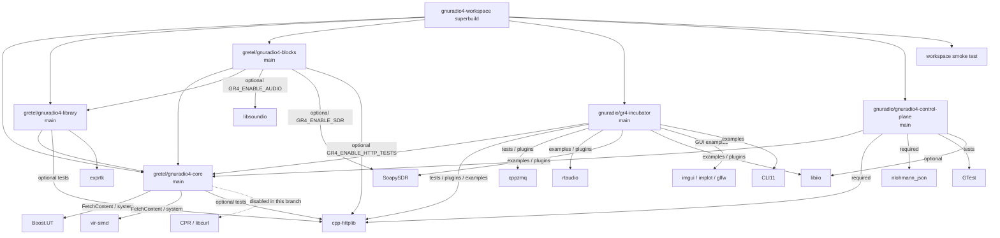

# gnuradio4-workspace dependency graph

## Option matrix

| CMake option | Repo | Default | Superbuild source | Effect |
|---|---|---|---|---|
| `GR4_ENABLE_HTTP_TESTS` | core, library, blocks | ON | `CONFIG_ENABLE_HTTP` | Build httplib-dependent tests |
| `GR4_ENABLE_AUDIO` | blocks | OFF | `CONFIG_ENABLE_AUDIO` | Build audio blocks; fatal if libsoundio missing |
| `GR4_ENABLE_SDR` | blocks | OFF | `CONFIG_ENABLE_SDR` | Build SoapySDR-based blocks |
| `CONFIG_ENABLE_HTTP` | superbuild Kconfig | y | — | Enables HTTP features (control-plane, incubator) |
| `GR_ENABLE_HTTP` | core (monorepo) | ON/OFF | — | HTTP client via CPR/libcurl (disabled in split) |

## Key decisions

- **cpp-httplib** is required only by `gr4-control-plane` and `gr4-incubator` (tests/plugins/examples).
- **libsoundio** **must** be present when `GR4_ENABLE_AUDIO=ON`; configure fails with a clear message otherwise.
- **libcurl** / **CPR** is **disabled** in the gretel core branch and the algorithm library.
- Several incubator deps (`rtaudio`, `SoapySDR`, `libiio`, `imgui`/`implot`/`glfw`) are only needed for examples/plugins/tests and are not pulled in by default profiles.
