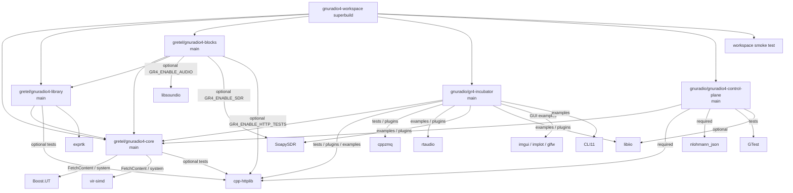

# gnuradio4-workspace dependency graph

## Workspace-level workarounds

The upstream gnuradio4-core and gnuradio4-library CMakeLists.txt
unconditionally call `find_package(httplib CONFIG QUIET)` and fatal on
missing cpp-httplib, regardless of `GR4_ENABLE_HTTP_TESTS`.  The
superbuild generates a minimal stub `httplibConfig.cmake` inside the
shared install prefix when `CONFIG_ENABLE_HTTP=n` (sdk / ci profiles),
satisfying the find without needing the real library.

Similarly, gnuradio4-blocks (`main`) expects
`find_package(gnuradio4Algorithm CONFIG)`, but gnuradio4-library
installs as `gnuradio4LibraryConfig.cmake`. A thin wrapper config
bridges the naming gap until the upstream repos converge.
